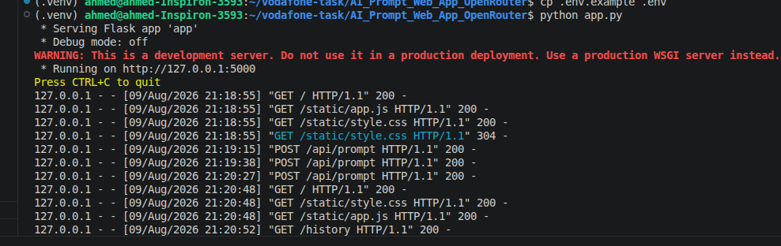
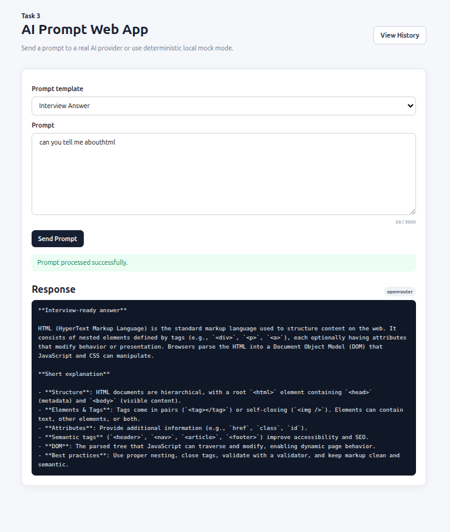

# Task 3 — AI Prompt Web App

A small, production-aware Flask application that accepts an AI prompt, applies a selected prompt template, sends it to a configurable provider, displays the response, and stores prompt history in SQLite.

## Features

- Flask backend with a single-page prompt UI.
- Prompt template selector:
  - General
  - Explain
  - Summarize
  - Interview Answer
- `POST /api/prompt` JSON endpoint.
- Real OpenAI API mode using an environment variable.
- Deterministic local mock mode when no API key is available.
- SQLite prompt history with:
  - UTC timestamp
  - prompt
  - template
  - provider mode
  - response
  - status
- `/history` page with keyword search.
- Input validation and maximum prompt length.
- Provider timeout/error handling.
- Responsive, lightweight frontend with no frontend framework.
- Automated tests with pytest.
- No credentials, API keys, or model paths are stored in source code.

## Architecture

```text
Browser
   |
   | POST /api/prompt
   v
Flask Application
   |
   +--> Validate prompt/template
   |
   +--> AI Provider Service
   |       |
   |       +--> OpenAI API (real mode)
   |       |
   |       +--> Deterministic mock (local mode)
   |
   +--> SQLite history
   |
   v
JSON response
```

## AI provider and mock mode

The primary AI provider for this project is OpenRouter. OpenRouter exposes an OpenAI-compatible API, so the existing Python OpenAI SDK can be used with OpenRouter's API base URL.

The default model is:

```text
openai/gpt-oss-20b:free
```

The application supports four real/provider modes plus local mock mode:

- `openrouter` — use OpenRouter with `OPENROUTER_API_KEY`.
- `gemini` — use Gemini with `GEMINI_API_KEY`.
- `openai` — use OpenAI with `OPENAI_API_KEY`.
- `auto` — try OpenRouter, then Gemini, then OpenAI, then deterministic mock mode.
- `mock` — always use deterministic local mode.

Mock mode does not call the network and does not use randomness. It returns a predictable response containing the received prompt and selected template. This allows reviewers to run the application without credentials.

## Requirements

- Python 3.10+
- pip
- An OpenAI API key only if real API mode is required.

## Setup

### 1. Create a virtual environment

Linux/macOS:

```bash
python3 -m venv .venv
source .venv/bin/activate
```

Windows PowerShell:

```powershell
python -m venv .venv
.venv\Scripts\Activate.ps1
```

### 2. Install dependencies

```bash
pip install -r requirements.txt
```

### 3. Configure environment variables

Copy `.env.example` to `.env`.

For local review without an API key:

```env
AI_PROVIDER=mock
```

Or use automatic fallback:

```env
AI_PROVIDER=auto
OPENAI_API_KEY=
```

For Gemini via Google AI Studio:

```env
AI_PROVIDER=gemini
GEMINI_API_KEY=your_key_here
GEMINI_MODEL=gemini-2.5-flash
```

For real OpenAI mode:

```env
AI_PROVIDER=openai
OPENAI_API_KEY=your_key_here
OPENAI_MODEL=gpt-5-mini
```

Never commit `.env`.

### 4. Run

```bash
python app.py
```

Open:

```text
http://127.0.0.1:5000
```

SQLite is created automatically as `prompt_history.db`.

## Production-aware deployment

For a production-style local run, use Gunicorn:

```bash
gunicorn --bind 0.0.0.0:5000 app:app
```

Recommended production settings:

```env
FLASK_DEBUG=false
AI_TIMEOUT_SECONDS=20
MAX_PROMPT_LENGTH=5000
```

For a real deployment, use a managed secrets mechanism instead of a `.env` file and place the application behind HTTPS/reverse proxy infrastructure.

## API

### POST `/api/prompt`

Request:

```json
{
  "prompt": "Explain REST APIs",
  "template": "explain"
}
```

Successful response:

```json
{
  "ok": true,
  "response": "...",
  "provider_mode": "mock"
}
```


Possible client errors:

- `400` — empty prompt or invalid template.
- `413` — prompt is larger than `MAX_PROMPT_LENGTH`.
- `502` — provider/API failure.
- `504` — provider timeout.

## History

Open:

```text
/history
```

Search example:

```text
/history?q=flask
```

The application uses parameterized SQLite queries for search input.


## Testing

Run:

```bash
pytest -q
```

The test suite covers:

- Home page
- Empty input
- Successful mock mode
- Oversized prompt
- History search

## OpenRouter setup

Create an OpenRouter API key and store it only in `.env`:

```env
AI_PROVIDER=openrouter
OPENROUTER_API_KEY=your_key_here
OPENROUTER_MODEL=openai/gpt-oss-20b:free
```

The application sends requests to:

```text
https://openrouter.ai/api/v1
```

The OpenRouter model is configurable through `OPENROUTER_MODEL`, so you can change the model later without modifying Python code.

## Troubleshooting

### The app says the real provider is not configured

Check:

```env
AI_PROVIDER=auto
OPENAI_API_KEY=...
```

or simply use:

```env
AI_PROVIDER=mock
```

### OpenAI request fails

Verify:

1. The API key is valid.
2. `OPENAI_MODEL` is available to your account.
3. The machine has network access.
4. Your provider account has available quota/credits.

### Port already in use

Change:

```env
FLASK_PORT=5001
```

Then run the application again.

### History is empty

Make sure the application can write to the directory containing `prompt_history.db`.

## Suggested Git commit progression

The assessment asks for commits showing build progress. A clean progression is:

```bash
git init
git add .
git commit -m "chore: initialize Flask project"

git add .
git commit -m "feat: add prompt API and mock provider"

git add .
git commit -m "feat: add SQLite prompt history"

git add .
git commit -m "feat: add prompt UI and history search"

git add .
git commit -m "test: add application tests"

git add .
git commit -m "docs: add setup and troubleshooting guide"
```

Do not squash these commits if the reviewer specifically wants to see development progress.

## Screenshots to include in the submission

Capture these three states:

1. Successful prompt submission showing the response and `real` or `mock` badge.
2. Empty prompt submission showing the user-friendly validation message.
3. `/history` showing stored prompts and keyword search.

Suggested filenames:

```text
screenshots/
├── 01-successful-prompt.png
├── 02-empty-input.png
└── 03-history-page.png
```

## Security notes

- API keys are read from environment variables.
- `.env` is ignored by Git.
- User input is validated before provider calls.
- Prompt length is bounded.
- SQLite queries use parameters rather than string interpolation.
- Provider errors are not exposed as raw stack traces to users.
- Flask debug mode is disabled by default.
- The application does not persist API credentials.

## Deliverables checklist

- [x] Flask application
- [x] HTML template
- [x] Static CSS/JavaScript
- [x] Requirements file
- [x] Environment variable example
- [x] SQLite auto-create logic
- [x] Prompt history
- [x] Keyword search
- [x] Real API mode
- [x] Deterministic mock mode
- [x] Input validation
- [x] Error and timeout handling
- [x] Automated tests
- [x] README
- [ ] Screenshots — capture after running the app
- [ ] Git commit history — create the commits listed above
