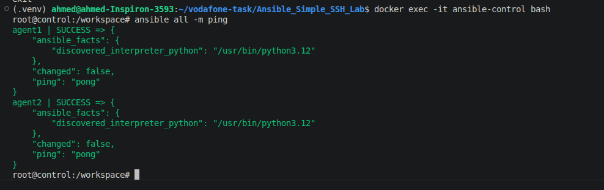
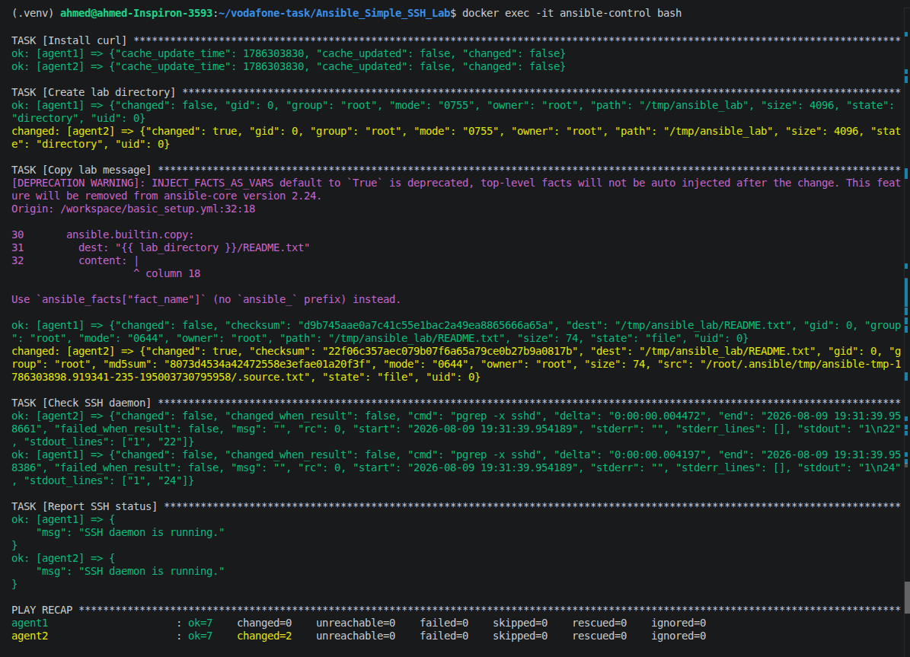
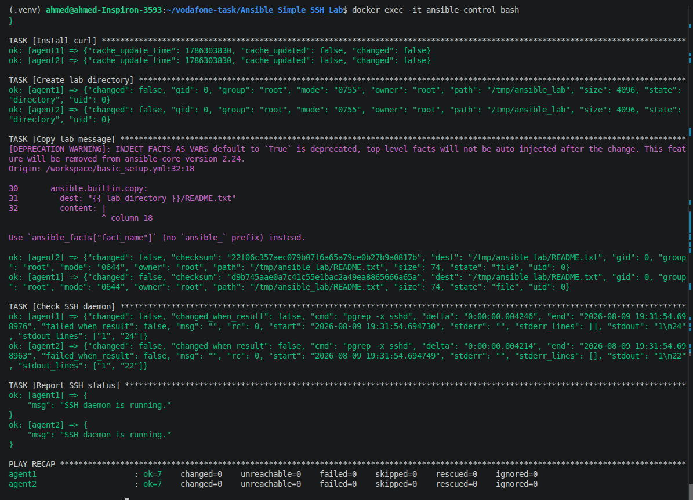

# Task 4 — Ansible Basics Lab

A simple Docker-based Ansible lab for the bonus assessment.

## Containers

* `ansible-control` — Ansible control machine.
* `ansible-agent1` — Ubuntu Linux target.
* `ansible-agent2` — Ubuntu Linux target.

The control container generates its own SSH key pair. The public key is then copied manually to the `authorized_keys` file of both target containers.

## Quick Start

### 1. Build and start the containers

From the project root:

```bash
docker compose up -d --build
```

Check that all containers are running:

```bash
docker compose ps
```

### 2. Enter the Ansible control container

```bash
docker compose exec control bash
```

### 3. Generate an SSH key inside the control container

Inside the control container:

```bash
ssh-keygen -t ed25519 -C "ansible-control"
```

Press `Enter` to use the default location:

```text
/root/.ssh/id_ed25519
```

Press `Enter` twice to create the key without a passphrase.

Verify the generated files:

```bash
ls -la /root/.ssh/
```

You should have:

```text
id_ed25519
id_ed25519.pub
```

### 4. Display the public key

```bash
cat /root/.ssh/id_ed25519.pub
```

Copy the entire output.

It should look similar to:

```text
ssh-ed25519 AAAAC3... ansible-control
```

**Never copy or expose `/root/.ssh/id_ed25519`. Only the `.pub` key should be copied to the target containers.**

### 5. Add the public key to agent1

Open another terminal on the host machine:

```bash
docker exec -it ansible-agent1 bash
```

Create the SSH directory:

```bash
mkdir -p /root/.ssh
chmod 700 /root/.ssh
```

Edit the authorized keys file:

```bash
nano /root/.ssh/authorized_keys
```

Paste the public key copied from the control container.

Save the file and run:

```bash
chmod 600 /root/.ssh/authorized_keys
```

Exit:

```bash
exit
```

### 6. Add the public key to agent2

```bash
docker exec -it ansible-agent2 bash
```

Create the SSH directory:

```bash
mkdir -p /root/.ssh
chmod 700 /root/.ssh
```

Edit:

```bash
nano /root/.ssh/authorized_keys
```

Paste the same public key.

Then:

```bash
chmod 600 /root/.ssh/authorized_keys
exit
```

## 7. Test SSH connectivity

Return to the control container:

```bash
docker compose exec control bash
```

Test agent1:

```bash
ssh -i /root/.ssh/id_ed25519 root@agent1
```

If the connection succeeds:

```bash
exit
```

Test agent2:

```bash
ssh -i /root/.ssh/id_ed25519 root@agent2
```

Then:

```bash
exit
```

Both SSH connections should work without asking for a password.

## 8. Test Ansible connectivity

Inside the control container:

```bash
cd /workspace
```

Run:

```bash
ansible all -m ping
```

Expected result:

```text
agent1 | SUCCESS => {
    "changed": false,
    "ping": "pong"
}

agent2 | SUCCESS => {
    "changed": false,
    "ping": "pong"
}
```

This confirms that the Ansible control machine can connect to both Linux targets.

## 9. Run the playbook

Run:

```bash
ansible-playbook basic_setup.yml
```

The playbook performs the following tasks:

1. Gathers Ansible facts.
2. Displays the hostname.
3. Displays the OS family.
4. Displays the IP address.
5. Displays the system uptime.
6. Installs `curl`.
7. Creates `/tmp/ansible_lab`.
8. Copies a text file to `/tmp/ansible_lab/README.txt`.
9. Checks whether the `sshd` process is running.

## 10. Run the playbook a second time

Run:

```bash
ansible-playbook basic_setup.yml
```

The second run demonstrates **idempotence**.

Because `curl`, the directory, and the file are already in the desired state, those tasks should normally report:

```text
changed=0
```

The final `PLAY RECAP` should show fewer changes than the first execution.

## 11. Verify the results

Check the file on both agents:

```bash
ansible all -a "cat /tmp/ansible_lab/README.txt"
```

Check that `curl` is installed:

```bash
ansible all -a "curl --version"
```

Check the SSH daemon:

```bash
ansible all -a "pgrep -a sshd"
```

## Project Structure

```text
Task4_Ansible_Docker_Lab/
│
├── docker-compose.yml
│
├── control/
│   └── Dockerfile
│
├── agent/
│   ├── Dockerfile
│   └── entrypoint.sh
│
└── lab/
    ├── ansible.cfg
    ├── inventory.ini
    ├── basic_setup.yml
    ├── README.md
    └── screenshots/
```

There is **no `ssh/` directory** in this version.

The SSH key is generated dynamically inside the `ansible-control` container.

## Inventory

The inventory contains two Linux targets:

```ini
[linux_vms]
agent1 ansible_host=agent1
agent2 ansible_host=agent2
```

Ansible uses:

```ini
ansible_user=root
ansible_connection=ssh
ansible_ssh_private_key_file=/root/.ssh/id_ed25519
```

The private key remains inside the control container.

## SSH Authentication Workflow

```text
ansible-control
      │
      │ ssh-keygen
      ▼
/root/.ssh/
├── id_ed25519
└── id_ed25519.pub
      │
      │ copy public key only
      ├──────────────────────┐
      ▼                      ▼
   agent1                  agent2
authorized_keys          authorized_keys
      │                      │
      └──────────┬───────────┘
                 ▼
           Ansible SSH
                 │
                 ▼
         Both Linux targets
```

## Using `ssh-add`

You can also load the generated private key into an SSH agent:

```bash
eval "$(ssh-agent -s)"
ssh-add /root/.ssh/id_ed25519
```

However, `ssh-add` only loads the **private key into the SSH agent**. It does not copy the public key to the target machine.

The public key still needs to be added to:

```text
/root/.ssh/authorized_keys
```

on both agents.

For this lab, explicitly specifying:

```ini
ansible_ssh_private_key_file=/root/.ssh/id_ed25519
```

is simpler and makes the Ansible configuration easier to understand.

## Screenshots

### 1. Ansible Ping

Run:

```bash
ansible all -m ping
```


### 2. First Playbook Run

Run:

```bash
ansible-playbook basic_setup.yml
```


### 3. Second Playbook Run

Run:

```bash
ansible-playbook basic_setup.yml
```




## Assessment Mapping

| Requirement           | Implementation                          |
| --------------------- | --------------------------------------- |
| Two Linux VMs         | `agent1` and `agent2` Ubuntu containers |
| Inventory             | `lab/inventory.ini`                     |
| SSH connectivity      | SSH public-key authentication           |
| SSH key generation    | `ssh-keygen` inside control container   |
| Public key deployment | Manual `authorized_keys` configuration  |
| Ping                  | `ansible all -m ping`                   |
| Playbook              | `lab/basic_setup.yml`                   |
| Facts                 | `gather_facts: true`                    |
| Hostname              | `ansible_hostname`                      |
| OS family             | `ansible_os_family`                     |
| IP address            | `ansible_default_ipv4.address`          |
| Uptime                | `ansible_uptime_seconds`                |
| Package               | `curl`                                  |
| File copy             | `/tmp/ansible_lab/README.txt`           |
| Folder                | `/tmp/ansible_lab`                      |
| Service check         | `sshd` process                          |
| Idempotence           | Run playbook twice                      |
| Documentation         | This README                             |

## Security Notes

This lab intentionally uses root SSH access to keep the bonus assessment simple.

For production environments, use:

* A dedicated non-root Ansible user.
* SSH keys or an SSH agent.
* `become` for privileged operations.
* Ansible Vault or another secret-management system.
* Strict SSH host-key verification.
* Proper access controls.

The private SSH key generated inside the control container is not stored in the project files or committed to Git.

## Cleanup

From the project root:

```bash
docker compose down
```

To remove the containers and locally built images:

```bash
docker compose down --rmi local
```

The SSH key disappears when the control container is removed because it is generated inside the container and is not mounted from the host.
