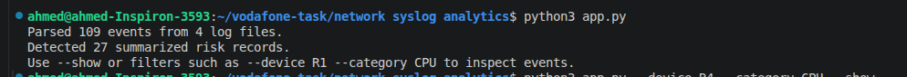

# Network Syslog Analytics

A Python CLI tool for the assessment Task 1. It parses router syslog files, normalizes events, detects operational risks, stores results in SQLite, and exports CSV reports.

## Architecture

The implementation is intentionally split into small modules:

```text
app.py
  ├── cli.py          -> command-line arguments and filtering
  ├── parser.py       -> raw log parsing
  ├── models.py       -> Event data model
  ├── detectors.py    -> operational risk detection
  ├── database.py     -> SQLite persistence
  └── reporter.py     -> CSV reports
```

The central model is the `Event` dataclass. `RiskDetector` groups the risk rules in one class so the rules are easier to test and extend.

## Project structure

```text
network_syslog_analytics/
├── app.py
├── logs/
│   ├── 2025-10-17-R1-R2.txt
│   ├── 2025-10-18-R3-R4.txt
│   ├── 2025-10-19-mixed.txt
│   └── 2025-10-20-critical.txt
├── events.csv
├── risk_report.csv
└── network_events.db
```

## Requirements

- Python 3.9+
- Standard library only; no external packages are required.

## Run

From the project directory:

```bash
python3 app.py
```

This parses all files and creates:

- `events.csv`
- `risk_report.csv`
- `network_events.db`

## Filtering

Filter by date:

```bash
python3 app.py --date 2025-10-19 --show
```

Filter by device:

```bash
python3 app.py --device R2 --show
```

Filter by severity:

```bash
python3 app.py --severity ERROR --show
```

Filter by event category:

```bash
python3 app.py --category CPU --show
```

Filter by risk:

```bash
python3 app.py --risk Critical --show
```

Filters can be combined:

```bash
python3 app.py --date 2025-10-20 --device R4 --category CPU --show
```

## Parsing model

Each log line follows the supplied assessment format:

```text
YYYY-MM-DD HH:MM:SS DEVICE SEVERITY MESSAGE
```

The parser extracts:

- timestamp
- device
- severity
- message
- event category
- interface
- BGP neighbor
- source IP
- numeric CPU threshold

Categories:

- Interface
- BGP
- CPU
- Thermal
- SNMP/Security
- Other

## Risk rules

### Interface

A flap is detected when the same device/interface changes from `down` to `up` within 5 minutes.

- one flap: Low
- repeated two or more times in a one-hour window: Medium

### BGP

A BGP instability is detected when an established neighbor goes down within 10 minutes.

A device with more than two BGP down events in one day is also High risk.

### CPU

Only values greater than 80% are treated as spikes.

- more than two spikes within one hour: High
- any spike >= 95%: Critical

### SNMP/Security

Authentication failures are grouped by device and source IP.

- repeated failures from the same source IP against the same device: High

### Thermal

A thermal alarm is paired with the next `returned to normal` message for the same device/sensor. Recovery duration is calculated from the two timestamps.

## SQLite

The database contains:

### events

Normalized parsed events.

### risk_summary

Summarized risks and recommendations.

## Assumptions and limitations

1. The parser is designed for the exact syslog structure supplied with the assessment.
2. Thermal numeric values are not present in the supplied logs; therefore the sensor number is retained, but it is not treated as a temperature value.
3. Interface flap detection pairs a `down` event with the next `up` event for the same interface.
4. BGP instability uses the latest preceding `established` event for the same device/neighbor.
5. SNMP repeated-source detection treats two or more failures from the same source IP/device as repeated.
6. Risk detection is deterministic and rule-based; it does not attempt anomaly detection or machine learning.
7. Malformed lines are skipped with a warning.
8. The tool accepts `.log` and `.txt` files so the supplied assessment files can be processed directly. Production input can be restricted to `.log` if required.
